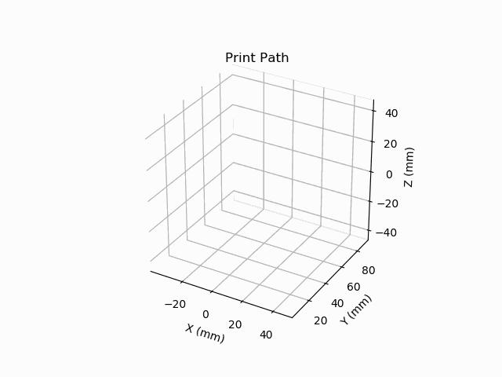
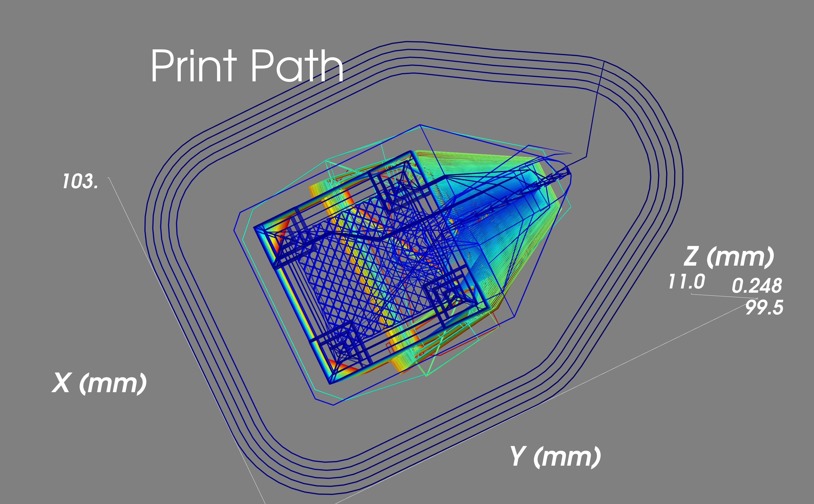
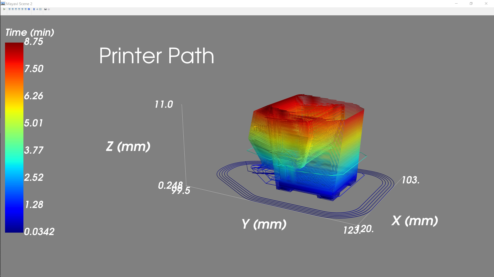

# gcody #

[](https://badge.fury.io/py/gcody)

## __WARNING__
I am no longer maintaining this project :( 
I hope to see some other GCODE abstractions/visualizers out there!
Please see [mecode](https://github.com/jminardi/mecode) for a better maintained project.


Gcody is a python wrapper for GCODE. It gives common programming language functionality to GCODE as well as several visualization tools.
This is an early draft of gcody and it is intended for general writing of GCODE, not printer specific code.
Gcody was inspired by [mecode](https://github.com/jminardi/mecode).


### Basics: ###

```python
# gcody example creating a serpentine pattern and an elephant

# these are both normally imported from gcody
from gcody import *

# creating parameters
distance = 10
cycles = 10

# creating gcode object
g = gcode()

# writes the GCODE command to use relative coordinates
# this changes how position is recorded internally (in gcode object)
# abs_coords is the default setting for gcode and is the default for gcody as well
g.rel_move()

# moves the print head back and forth in x
g.move(distance, speed=10, com='Moves head 10 in x')


# moves the print head back and forth in x
for i in range(1,cycles):
    # simple move allows for modality (not repeating commands)
    # it makes the GCODE prettier :)
    # unfortunately, not all printers support it :(
    g.simple_move(y=10) # movement in y
    g.simple_move((-1)**i * distance) # movement in x

# creates a matplotlib figure matching the path of the printer head
g.view('b')

# This is an animated figure showsing the progression of the printer path
g.animated('b',save_file='snake.gif')


# saves the GCODE to a file
g.save('snake') # outputs file 'snake.gcode'
g.save('snake.txt') # outputs file 'snake.txt'
```

The output GCODE is:
```GCODE
G91 ; use relative coordinates
F600 ; 10 mmps motion
G1 X10.000000 ; Moves head 10 in x
Y10.000000  
X-10.000000  
Y10.000000  
X10.000000  
Y10.000000  
X-10.000000  
Y10.000000  
X10.000000  
Y10.000000  
X-10.000000  
Y10.000000  
X10.000000  
Y10.000000  
X-10.000000  
Y10.000000  
X10.000000  
Y10.000000  
X-10.000000  
```





The other features of gcody are readying existing GCODE and displaying it:
```python

# file from https://www.thingiverse.com/thing:998999/#files
# gcode generated with latest Cura (https://ultimaker.com/en/products/ultimaker-cura-software)
file = 'elefante_small.gcode'

# This reads the GCODE file line by line and converts it into a gcode object
# GCODE file can be hundreds of thousands of lines, if not more. This means reading them
# can be slow. The math comes out to is roughly 13,000 move lines per second.
elefante = read(file)

# This figure colors the lines draw with a color that corresponds to a print time
elefante.cbar_view() # This method takes ~60 seconds to work.

# this view has a slider bar that allows one to select the print time
elefante.slide_view('r')
```


Or using the mayavi backend:




### Dependencies: ###
* [Numpy](https://github.com/numpy/numpy)
* [Matplotlib](https://github.com/matplotlib/matplotlib) or [Mayavi](http://docs.enthought.com/mayavi/mayavi/) as a viewing backend - (defaults to matplotlib)


### Optional Dependencies ###
* pillow, ImageMagic, of FFmpeg as optional dependancies for matplotlib to save videos


### To Do: ###
* Add clockwise motion commands
* Measure material needed for print job
* Record when extruding and when not
* Account for Printer Geometry
  - Nozzle hight, width
* Speed up larger viewing large GCODE files
  - Mayavi is much faster but can we do better?
* Add in other GCODE commands
  - Help with reading in printer specific code
* Add more complex combinations of move
* Take requests for features!
